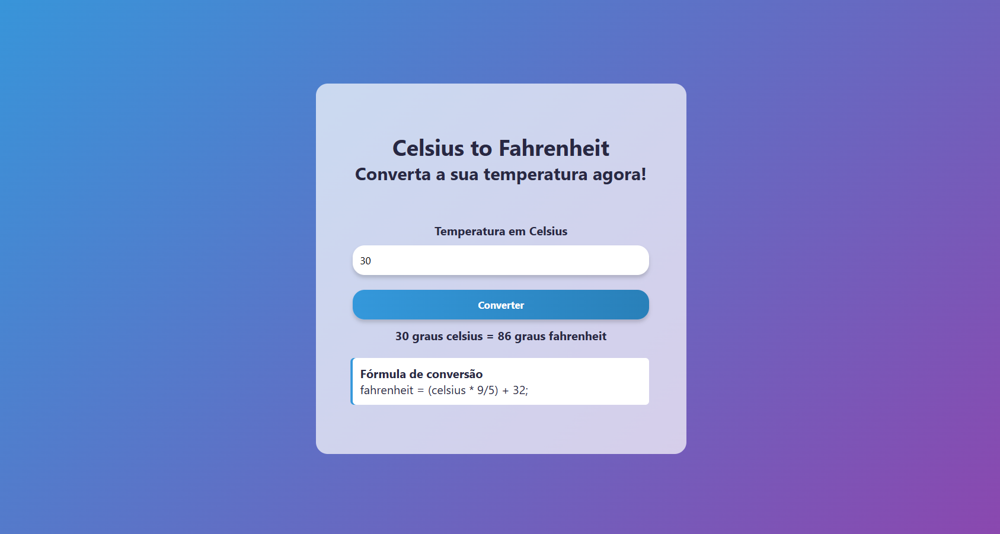
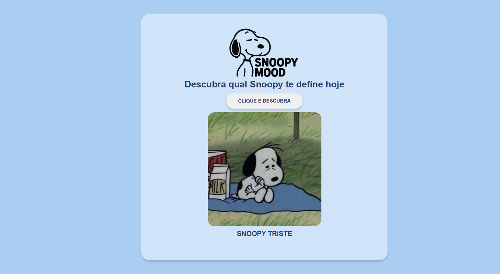
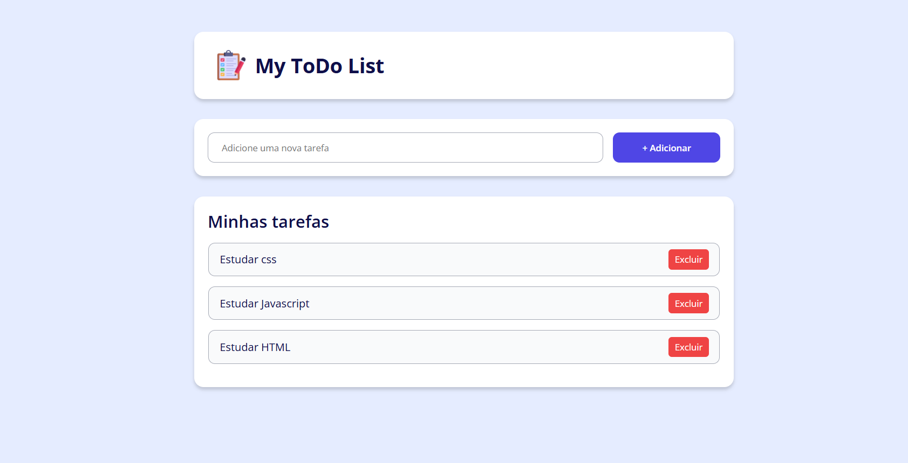

🧠 Projetos de Treino em JavaScript
Este repositório reúne alguns pequenos projetos desenvolvidos com o objetivo de praticar e aprimorar habilidades em JavaScript, além de consolidar conceitos de HTML e CSS. Cada projeto foca em um aspecto diferente da linguagem ou da interação com o DOM.

🚀 Projetos
1. 🌡️ Celsius to Fahrenheit
Descrição: Um conversor simples de temperatura que transforma valores de Celsius para Fahrenheit.
Funcionalidade: O usuário digita a temperatura em graus Celsius e recebe o resultado em Fahrenheit instantaneamente.
Habilidades treinadas: Manipulação de inputs, eventos e fórmulas matemáticas em JS.

2. 🍉 My Picnic
Descrição: Um mini joguinho com estética de piquenique.
Funcionalidade: O usuário pode clicar em alimentos e objetos que aparecem no lado da tela para adicioná-los ou removê-los da mesa de piquenique.
Habilidades treinadas: Manipulação do DOM, classes CSS, lógica de exibição condicional e interatividade visual.

3. 🐾 Snoopy Mood
Descrição: Um gerador de imagens e frases do Snoopy para representar o "humor do dia".
Funcionalidade: Ao clicar em um botão, uma nova imagem do Snoopy com uma frase aleatória sobre o dia é exibida.
Habilidades treinadas: Arrays, geração aleatória, exibição dinâmica de conteúdo e estilização com CSS.

4. ✅ To Do List
Descrição: Uma clássica lista de tarefas.
Funcionalidade: Adicione, marque como concluído e remova tarefas do seu dia a dia.
Habilidades treinadas: Estrutura de dados em JS, criação dinâmica de elementos, uso de eventos e controle de estado.

🛠 Tecnologias Utilizadas
HTML5

CSS3

JavaScript (Vanilla)
