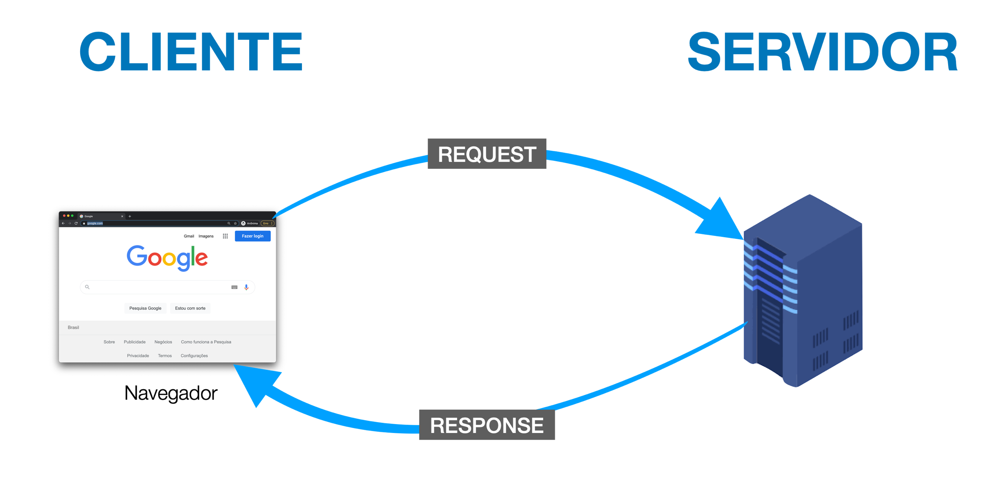
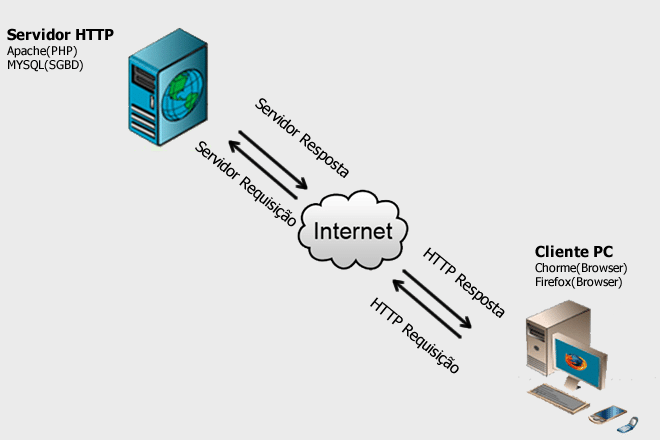
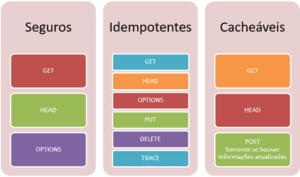

# EXPLICAÇÕES SOBRE O HTTP (Hyper Text Transfer Protocol)
==============================================================

## Conceitos básicos:

### O que é HTTP (HyperText Transfer Protocol)
HTTP, ou Hypertext Transfer Protocol, é um protocolo de comunicação utilizado para a transferência de informações na World Wide Web (WWW) e em outros sistemas de rede.

O HTTP é a base para que o cliente e um servidor web troquem informações. Ele permite a requisição e a resposta de recursos, como imagens, arquivos e as próprias páginas webs que acessamos, por meio de mensagens padronizadas. Com ele, é possível que um estudante num café em São Paulo leia um artigo que está armazenado em um servidor no Japão. (ALURA)

### Diferença entre HTTP e HTTPS
#### HTTP (HyperText Transfer Protocol):
Protocolo de aplicação usado para transferir páginas web, imagens, dados de formulários etc. É texto simples (não criptografado).

#### HTTPS (HTTP Secure):
é HTTP sobre TLS (antigo SSL) — ou seja, é o mesmo protocolo HTTP mas rodando dentro de uma camada segura de criptografia (TLS). Tudo trafega cifrado.


#### Diferença prática
HTTP não tem criptografia. Então qualquer transferência de informação pode ser interceptada e lida/alterada. Isso já não acontece com o HTTPS já que ele usa o TLS (Transport Layer Security) para cifrar os dados evitando leitura/edição de terceiros

o HTTPS exige um certificado X.509 emitido por uma Autoridade Certificadora (CA) confiável, que permite ao navegador validar que ele está falando com o servidor legítimo.

#### Como o usuário pode identificar
HTTP: normalmente aparece como “Não seguro” ou sem cadeado.

HTTPS: aparece com cadeado (e, se houver problemas no certificado, mostrará aviso de certificado inválido/expirado).
Ter HTTPS evita avisos que assustam usuários e reduz risco de abandono.

### O que é um cliente (navegador) e um servidor
Cliente / servidor é um modelo de interação no qual um programa envia uma solicitação para outro programa e aguarda uma resposta.. O programa solicitante é chamado de cliente; o programa que responde é chamado de servidor. Embora o modelo cliente / servidor possa ser usado entre programas em um único computador, o termo geralmente se refere a uma rede. Em uma rede, o modelo fornece uma maneira conveniente de interconectar programas que são distribuídos em diferentes locais (IBM)



#### O que é um cliente
O cliente é qualquer dispositivo ou software que solicita serviços ou recursos de outro computador (o servidor).
No contexto web, o cliente normalmente é o navegador (Chrome, Firefox, Edge, Safari), mas também pode ser um app de celular, um programa de email ou até um script que consome APIs.

#### Funções do cliente
1 - Fazer requisições: solicita dados ou serviços do servidor (ex.: abrir uma página web, enviar um formulário).

2 - Exibir ou processar respostas: mostra a página HTML, renderiza imagens, toca vídeos, ou processa dados recebidos.

3 - Gerenciar estado local: cookies, armazenamento local (localStorage, sessionStorage) e cache.

#### Exemplos de clientes
- Navegador web (Google Chrome, Firefox)

- Aplicativo de celular (Instagram, WhatsApp)

- Software de email (Outlook, Thunderbird)

- Scripts ou programas que fazem requisições HTTP (curl, Postman, apps backend que consomem APIs de terceiros)

#### O que é um navegador
O servidor é o computador ou software que responde aos pedidos do cliente, oferecendo recursos, serviços ou dados. Ele “serve” algo ao cliente.

#### Funções do servidor:

1 - Receber requisições: recebe pedidos HTTP, FTP, SMTP ou outro protocolo.

2 - Processar requisições: executa lógica de backend, consulta banco de dados, gera respostas dinâmicas (ex.: página de produto, resultado de busca).

3 - Enviar respostas: devolve os dados ou serviços solicitados para o cliente.

#### Exemplos de servidores
- Servidor web: Apache, Nginx, IIS — serve páginas HTML, imagens, CSS e JS.

- Servidor de banco de dados: MySQL, PostgreSQL — responde a consultas SQL do backend.

- Servidor de email: Exchange, Postfix — envia e recebe emails.

- Servidor de API: Node.js, Django, Laravel — processa requisições de dados e retorna JSON ou XML.

### Como cliente e servidor se comunicam
A comunicação geralmente segue o modelo cliente-servidor usando protocolos de rede, como HTTP/HTTPS.

#### Exemplo de fluxo web
1 - Você digita www.exemplo.com no navegador (cliente).

2 - O navegador envia uma requisição HTTP para o servidor que hospeda o site.

3 - O servidor recebe a requisição e processa: busca arquivos HTML, consulta banco de dados, monta a página.

4 - O servidor envia uma resposta HTTP (HTML, CSS, JS, imagens) de volta ao cliente.

5 - O navegador renderiza a página para você ver e interagir.
Resumo visual simplificado:

Usuário → Navegador (Cliente) → Requisição HTTP → Servidor → Resposta HTTP → Navegador → Usuário




### O que é um request (requisição) e um response (resposta)
Na web, a comunicação entre cliente e servidor ocorre por meio de duas ações principais: o request (solicitação) e a response (resposta). Por exemplo, quando você acessa um site, seu navegador (cliente) envia um request ao servidor onde o site está hospedado. Em seguida, o servidor envia de volta uma response, contendo o conteúdo da página, como textos, imagens ou dados de formulários. (DUPLO D)

#### Como funciona o ciclo de Request e Response?
Quando você digita um endereço no navegador e pressiona “Enter”, o navegador está enviando uma solicitação (request) para o servidor. Esse processo envolve vários passos, mas aqui está uma visão simplificada:

1 - O navegador envia um request ao servidor. Isso geralmente acontece usando o protocolo HTTP ou HTTPS.
2 - O servidor processa a solicitação. Ele busca os recursos necessários, como HTML, CSS, JavaScript ou dados de um banco de dados.
3 - O servidor responde com uma response. O conteúdo é enviado de volta ao navegador, que renderiza a página na tela.

| **Elemento** | **Descrição** |
|---------------|---------------|
| **Método** | O tipo de ação que está sendo solicitada (por exemplo, GET, POST, PUT, DELETE). |
| **URL** | O endereço do recurso que está sendo solicitado. |
| **Cabeçalhos** | Informações adicionais sobre a requisição, como o tipo de conteúdo aceito pelo cliente ou o endereço de IP do cliente. |
| **Corpo** | O conteúdo da requisição, se houver. Por exemplo, os dados de um formulário HTML enviados em uma requisição POST. |

#### exemplo básico de como uma solicitação HTTP pode ser feita usando a função fetch() em JavaScript:
```js
fetch('https://api.example.com/data')
  .then(response => response.json())
  .then(data => console.log(data))
  .catch(error => console.error('Erro:', error));
```

#### Tipos de request e response 
Existem diferentes métodos de request, sendo os mais comuns:

- GET: Pede ao servidor um recurso (como uma página ou uma imagem).
    Explicação: Solicita dados de um servidor. Apenas lê dados, não altera nada no servidor.

- POST: Envia dados ao servidor.
    Explicação: Envia dados para o servidor, normalmente para criar recursos ou processar informações.

- PUT: Atualiza um recurso existente no servidor.

- DELETE: Remove um recurso no servidor.



### O conceito de stateless (HTTP não mantém estado)
O protocolo HTTP é stateless (ou seja, “sem estado”) porque cada requisição é independente, o servidor não guarda memória das interações anteriores com o cliente. Isso significa que, toda vez que o navegador envia uma requisição, o servidor a trata como uma nova conexão, sem saber o que aconteceu antes. Por exemplo, ao fazer login em um site, o servidor valida seus dados, mas na próxima requisição ele não “lembra” que você já se autenticou, a menos que o sistema utilize mecanismos como cookies, sessões ou tokens para manter esse estado entre as requisições. Essa característica torna o HTTP mais simples, rápido e escalável, porém exige soluções adicionais para lidar com persistência de informações e autenticação de usuários.


### O que é um endpoint / rota / recurso

#### 1) Recurso — o "o quê"
Um recurso é a informação que você quer acessar no servidor.
É como um objeto do mundo real: um usuário, um produto, um pedido, uma foto, etc.

Exemplo:
    - O recurso pode ser um usuário (algo que existe no sistema).
    - Quando você quer ver todos os usuários, está pedindo o recurso “usuários”.
Então, “recurso” = o tipo de dado que você está lidando.

#### 2) Rota — o "quem processa"
A rota é o caminho (ou endereço interno do servidor) que leva até esse recurso. É como um “atalho” que diz qual parte do servidor deve responder a uma requisição.

Exemplo:
    - A rota /usuarios pode ser configurada para mostrar todos os usuários.
    - Outra rota /usuarios/:id pode mostrar um usuário específico.
```js
app.get("/usuarios", mostrarTodosUsuarios);
app.get("/usuarios/:id", mostrarUsuarioPorId);
```

### 3) Endpoint — o "onde/como"
O endpoint é a junção da rota com o método HTTP (como GET, POST, PUT, DELETE).
É o endereço completo de uma ação específica entre cliente e servidor.

### Exemplos de Endpoints

| Método | Rota | O que faz |
|--------|-------|-----------|
| **GET** | `/usuarios` | Lista todos os usuários |
| **POST** | `/usuarios` | Cria um novo usuário |
| **GET** | `/usuarios/1` | Mostra o usuário de ID 1 |
| **PUT** | `/usuarios/1` | Atualiza o usuário de ID 1 |
| **DELETE** | `/usuarios/1` | Deleta o usuário de ID 1 |


### Estrutura básica de uma URL
URL significa Uniform Resource Locator, ou “Localizador Uniforme de Recursos”.
Ela é o endereço completo de um recurso na internet, como o endereço de uma casa, mas no mundo digital.

Exemplo de URL:
- https://www.exemplo.com:443/usuarios/123?ativo=true#detalhes

Quando um computador se conecta a outro pela internet (por exemplo, quando o navegador acessa um site), essa conexão precisa saber exatamente por onde enviar e receber os dados.

É aí que entram as portas elas funcionam como “portas de entrada e saída” para diferentes tipos de comunicação dentro de um servidor.

Pense no servidor como um prédio:
- O endereço (domínio) é o prédio (www.site.com);
- As portas são as entradas específicas para diferentes serviços (como HTTP, HTTPS, FTP etc).

| Porta | Protocolo | Significado | Explicação Detalhada |
|--------|-------|-----------|---------------------|
| **80** | HTTP (HyperText Transfer Protocol) | Comunicação padrão sem criptografia | É usada para o tráfego comum da web. Quando você acessa http://site.com, o navegador se conecta à porta 80 do servidor. Os dados viajam em texto puro, o que significa que podem ser interceptados facilmente. |
| **443** | HTTPS (HyperText Transfer Protocol Secure) | Comunicação segura e criptografada | É usada para conexões HTTPS, que utilizam SSL/TLS para proteger os dados trocados entre cliente e servidor. Quando você acessa https://site.com, o navegador se conecta à porta 443 e estabelece uma conexão segura (com o cadeado na barra de endereços). |